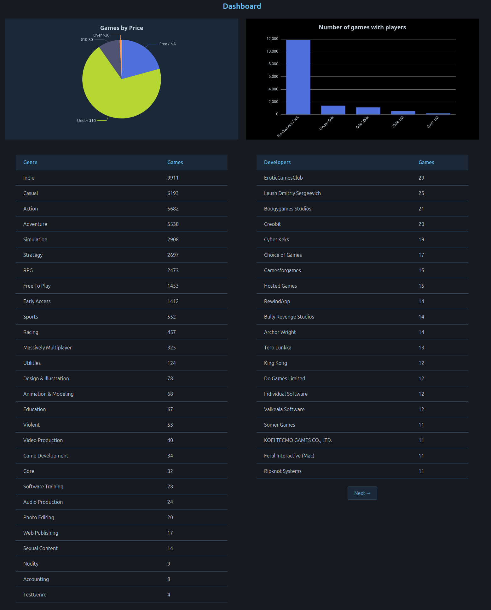
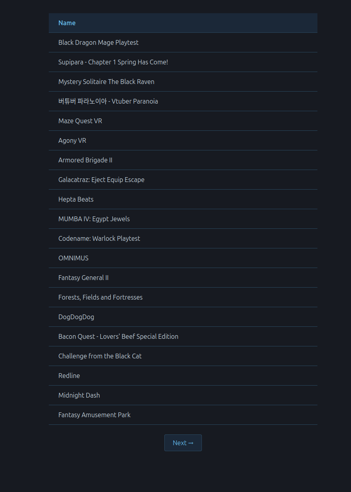
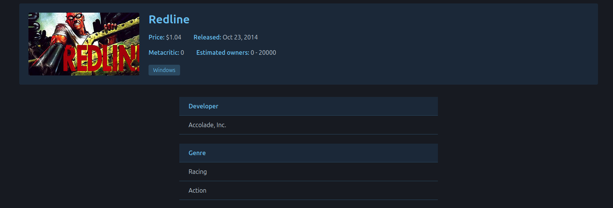
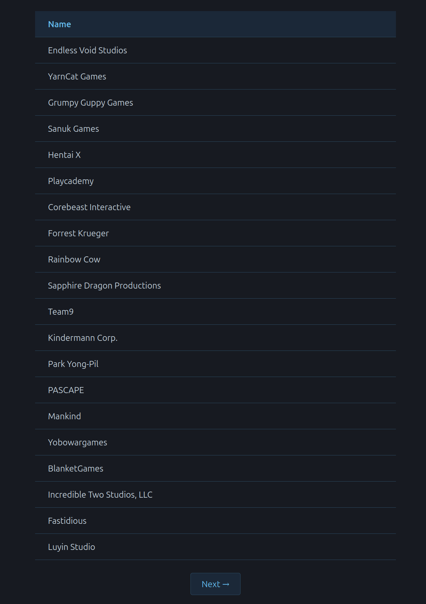
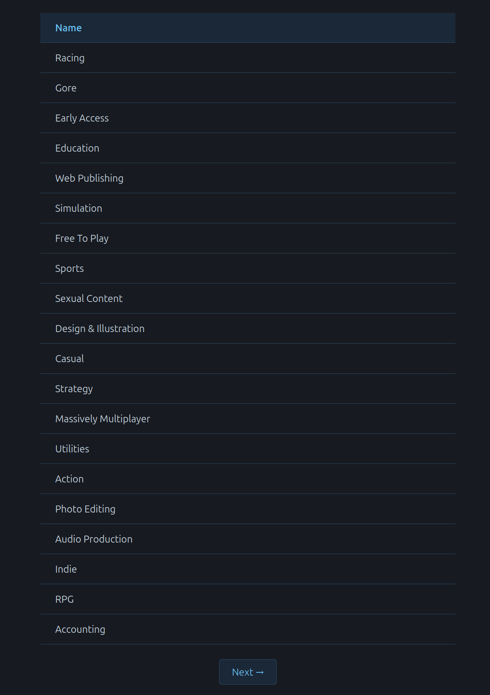
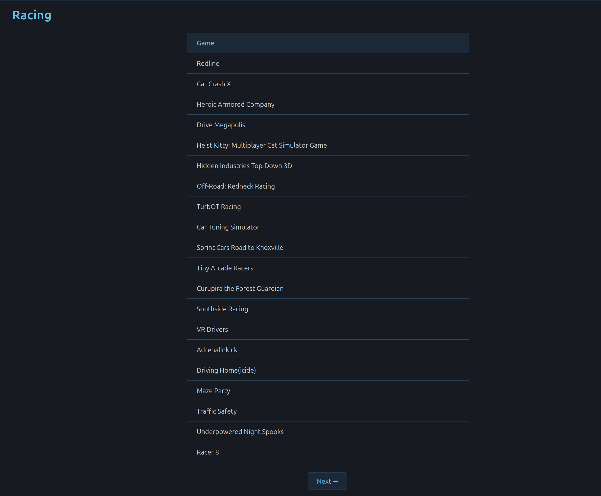

## Project Name

Steam Games Archive App

## Overview

A visually engaging and _interactive_ data visualization web application built on top of a REST API with 15,000 Steam
games.
Users authenticate via OAuth and can explore games, developers, and genres through an interactive dashboard.

- The application visualizes the data from the [_API_](https://github.com/jensprog/steam-data)
  which uses 15,000 Steam games. The application enables users to manually check games, developers and genres by
  themselves and each resource has related links to other resources.
- The user can navigate to /games and click on a specific game and will receive information about that game and if the
  game has any developers and genres listed, the user can navigate to the developer(s) and genre(s) and get more
  information about those resources.

- Users can also navigate to /dashboard to see a PieChart, BarChart and two tables with data that I thought would be
  most interesting.
- PieChart visualizes the number of games that are present in the dataset and how much they cost in a set of ranges
  between 0-10, 10-30, over 30 and games that are free or if the price is not announced(prices in dollars).
- BarChart visualizes the number of games that have players owning them, the ranges under 50K, 50-200K, 200K-1M, over 1M
  and no owners or not announced in the dataset.
- The tables are showing the number of genres present in the dataset and how many games have the specific genre and
  number of developers in the dataset and how many games they have created. The developer table is using isolated
  pagination (not url based pagination) to navigate through if the user wants to look for a specific developer.
  Pagination was not used in the genre table because it's only 27 genres (28 if you count one I created myself) and
  would create unnecessary overhead.

## Deployed Application

[_Link to public URL_](https://cu2107.camp.lnu.se/)

## Core Technologies Used

| Layer             | Choice             |
|-------------------|--------------------|
| **Visualization** | Apache E-charts.   |
| **Front-end**     | Vue, Nuxt.js, TSC. |
| **Styling**       | Tailwind CSS       |
| **Deployment**    | Docker, Nginx      |

- For the application I used Nuxt.js as the main framework using TypeScript as language.
- TailwindCSS for styling.
- Vue.js (via Nuxt) for frontend components and pages.
- Docker with GitHub Actions.

## Deployment

The application is containerized using Docker and deployed on a server. The frontend (Nuxt) and backend (FastAPI) each
run in their own container, orchestrated with Docker Compose. Nginx acts as a reverse proxy, routing `/api/*` traffic to
the FastAPI container and all other requests to the Nuxt container. A GitHub workflows pipeline automatically builds and
publishes a new Docker image to the GitHub registry on every push to master.

## How to Use

- dashboard.png shows the main visualization of the application. You can hover over the PieChart or BarChart for more
  readable data than just looking at the actual chart. For example, hovering over the PieChart shows the amount of games
  that cost X-dollars and the percentage of the pie that the price range covers. BarChart is showing only the number of
  games that have X-amount of players owning the game.

- allgames.png shows all the games that are in the 15,000 Steam dataset, only showing 20 results per page for
  performance. Using pagination with **Next** and **Previous** buttons in the bottom to navigate through the list of
  games.

- specificgame.png shows a specific game and its related data. Developers and Genres are clickable links so the user can
  navigate further into the application to get specific data. For instance, the user might be interested in what the
  Developer **Accolade, Inc.** has created more than the game Redline, the user can click on the name and get a list of
  games that the developer has created and navigate to each game from there.

- developers.png is just like allgames.png, shows all the developers in the dataset and only 20 results per page for
  performance. Clickable links to check a specific developer's games.

- genres.png is showing all different genres in the dataset and their related games. For instance, if you click on "
  Racing" the next page will display all games
  having that genre.

- specificgenre.png shows a specific genre and its related games.

## Acknowledgements

**Shoutout:**

- https://www.kaggle.com/datasets/fronkongames/steam-games-dataset
